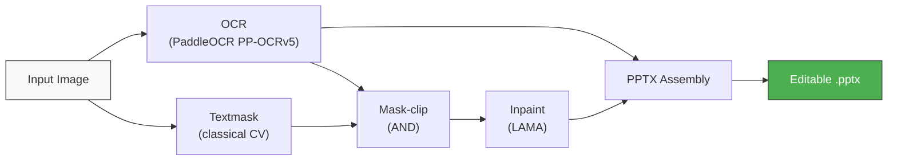

# px-image2pptx

[](https://opensource.org/licenses/MIT)
[](https://www.python.org/downloads/)

Convert static images to editable PowerPoint slides. OCR detects text, classical CV builds a text mask, LAMA inpaints the background clean, and python-pptx reconstructs everything as individually editable text boxes over the restored background.

**I also hosted a browser tool:** [pxGenius.ai](https://pxgenius.ai)
- **Free mode** — runs entirely in-browser with ONNX models, no download needed. Includes a built-in slide editor for repositioning text boxes, adjusting fonts, and fine-tuning the result before exporting.
- **AI mode** — enhanced accuracy powered by Gemini, affordable per-use pricing

## How it works



1. **OCR** detects text regions with bounding boxes and content
2. **Textmask** finds text ink pixels using adaptive thresholding (no ML)
3. **Mask-clip** ANDs textmask with OCR bboxes — only confirmed text is masked (preserves illustrations, borders, icons)
4. **Inpaint** reconstructs the masked regions using LAMA neural inpainting
5. **Assemble** places editable text boxes over the clean background with auto-scaled fonts and detected text colors

## Examples

Each pair shows the **original image** (left) and the **reconstructed PPTX preview** (right). Blue-highlighted regions are editable text boxes placed over the inpainted background.

### Works well

**Photo slide with text on solid/flat regions** — Text sits on a plain beige background separate from the photos. LAMA cleanly inpaints the flat area, and photos are preserved untouched because the OCR-guided mask only targets confirmed text regions.

| Input | Reconstructed PPTX |
|-------|-------------------|
|  |  |

**Chart with labels** — The pie chart's visual elements (wedges, colors) are preserved because the textmask only fires on high-contrast text ink, not on smooth gradients. Labels are lifted into editable text boxes at their correct positions.

| Input | Reconstructed PPTX |
|-------|-------------------|
|  |  |

**Dense text over a photo background** — Even with a complex photographic background (Chrysler Building), LAMA reconstructs plausible texture behind removed text. Multiple font sizes and a two-column layout are handled by the column-aware line grouping.

| Input | Reconstructed PPTX |
|-------|-------------------|
|  |  |

**Chinese + English mixed text on textured background** — The `ch` OCR model recognizes both languages in a single pass. LAMA inpaints over the watercolor-style texture naturally, and CJK font sizing uses fullwidth em metrics for accurate placement.

| Input | Reconstructed PPTX |
|-------|-------------------|
|  |  |

### Challenging

**Very thick/large fonts** — The bold text ("362 MILES") uses an unusually thick, oversized font that exceeds the standard mask dilation range. The default parameters are tuned for typical slide text sizes, so extra-large or decorative fonts may not be fully covered by the dilated mask, leaving partial ink artifacts in the inpainted background.

| Input | Reconstructed PPTX |
|-------|-------------------|
|  |  |

**Dense chart with axis labels** — The bar chart has text tightly integrated with the visual data (axis ticks, legend labels sitting on colored bars). Removing text here also removes parts of the chart structure. LAMA fills in the gaps, but the reconstructed chart loses some bars and axis lines. This is a fundamental limitation: when text *is* the data, removing it destroys information.

| Input | Reconstructed PPTX |
|-------|-------------------|
|  |  |

## Limitations

- **Text on complex backgrounds**: When text overlaps photos, illustrations, or gradients, LAMA inpainting must guess what's behind the text. Results range from good (flat areas, repeating textures) to poor (faces, fine details, structured objects).
- **Text that is part of the visual**: Axis labels, legend entries, and annotations that are tightly coupled to a chart or diagram cannot be cleanly separated. Removing them degrades the visual.
- **Font matching**: The pipeline uses Arial/Helvetica as a generic font. Decorative, serif, or handwritten fonts in the original will not be reproduced — the text content is correct but the typeface will differ.
- **Text layout**: Each OCR detection becomes a flat, left-aligned text box. The original may have centered text, justified paragraphs, or multi-line formatting that is not reconstructed.
- **Light text on dark backgrounds**: The classical textmask detects dark ink on light backgrounds. For inverted color schemes (white text on black), the textmask misses the text pixels. OCR still detects the text, but the mask falls back to bounding-box rectangles instead of tight ink outlines, which can produce blockier inpainting.
- **WebP input**: PaddleOCR (v3.x) does not support WebP images. Convert to PNG/JPG before processing.
- **Very large images**: LAMA inpainting time scales with image resolution. Images above ~4000px on the long side can take minutes. Consider downscaling first for faster processing.

## Installation

```bash
git clone https://github.com/pxgenius/px-image2pptx.git
cd px-image2pptx
pip install -e ".[all]"
```

Or install with only the deps you need:

```bash
# Core only (textmask + assembly, no OCR/inpainting)
pip install -e .

# With OCR
pip install -e ".[ocr]"

# With inpainting
pip install -e ".[inpaint]"
```

## Quick start

### Python API

```python
from px_image2pptx import image_to_pptx

report = image_to_pptx("slide.png", "output.pptx")
print(f"Created {report['text_boxes']} text boxes in {report['timings']}s")
```

### CLI

```bash
# Full pipeline
px-image2pptx slide.png -o output.pptx

# Chinese slide
px-image2pptx slide.png -o output.pptx --lang ch

# Skip inpainting (solid bg or original image as background)
px-image2pptx slide.png -o output.pptx --skip-inpaint

# With pre-computed OCR JSON (skips PaddleOCR)
px-image2pptx slide.png -o output.pptx --ocr-json text_regions.json

# Keep intermediate files for debugging
px-image2pptx slide.png -o output.pptx --work-dir ./debug/
```

## CLI options

| Option | Default | Description |
|--------|---------|-------------|
| `-o`, `--output` | `output.pptx` | Output PPTX path |
| `--ocr-json` | | Pre-computed OCR JSON (skips OCR step) |
| `--lang` | `auto` | OCR language: `auto`, `en`, or `ch` |
| `--sensitivity` | `16` | Textmask sensitivity (lower = more aggressive) |
| `--dilation` | `12` | Textmask dilation pixels |
| `--min-font` | `8` | Minimum font size in points |
| `--max-font` | `72` | Maximum font size in points |
| `--skip-inpaint` | | Skip LAMA inpainting |
| `--work-dir` | | Directory for intermediate files |

## Python API

### One-line conversion

```python
from px_image2pptx import image_to_pptx

report = image_to_pptx(
    "slide.png",
    "output.pptx",
    lang="auto",         # auto-detect language
    sensitivity=16,      # textmask sensitivity
    dilation=12,         # textmask dilation
    skip_inpaint=False,  # set True for solid-bg slides
)
```

### Step-by-step pipeline

```python
import cv2
from px_image2pptx.ocr import run_ocr
from px_image2pptx.textmask import compute_masks
from px_image2pptx.inpaint import inpaint
from px_image2pptx.assemble import assemble_pptx

# Step 1: OCR
regions = run_ocr("slide.png", lang="ch")

# Step 2: Textmask + clip + dilate
image_bgr = cv2.imread("slide.png")
tight, clipped, dilated = compute_masks(image_bgr, regions)

# Step 3: Inpaint
image_rgb = cv2.cvtColor(image_bgr, cv2.COLOR_BGR2RGB)
background = inpaint(image_rgb, dilated)
Image.fromarray(background).save("background.png")

# Step 4: Assemble
report = assemble_pptx(
    image_path="slide.png",
    ocr_regions=regions,
    output_path="output.pptx",
    background_path="background.png",
    tight_mask=tight,
)
```

### Using pre-computed OCR

If you already have OCR results (from any OCR engine), provide them directly:

```python
from px_image2pptx import image_to_pptx

report = image_to_pptx(
    "slide.png",
    "output.pptx",
    ocr_json="my_ocr_results.json",
)
```

The OCR JSON format:

```json
{
  "text_regions": [
    {
      "id": 0,
      "text": "Hello World",
      "confidence": 0.95,
      "bbox": {"x1": 100, "y1": 50, "x2": 400, "y2": 90}
    }
  ]
}
```

## Key features

### Font auto-scaling

Font sizes are automatically scaled to fill 90-94% of the OCR bounding box width. Uses actual font metrics via PIL (Arial/Helvetica) for Latin text and fullwidth em (1.0x) for CJK characters.

### Text color detection

Each text box gets its detected color from the original image, not a hardcoded color. Uses the tight (pre-dilation) mask to sample ink pixels. For light text on dark backgrounds (where the textmask misses the text), falls back to sampling pixels most different from the local background.

### Column-aware line grouping

OCR word-level detections are merged into line-level text boxes using two-pass grouping: vertical proximity first, then horizontal gap splitting. Prevents merging text from different columns into one wide text box.

### OCR-guided masking

The raw textmask detects any dark high-contrast pixels (including illustration outlines, table borders, icons). The mask-clip step ANDs it with OCR bounding boxes so only confirmed text gets inpainted. This preserves non-text elements perfectly.

## Dependencies

**Core** (always installed):
- Pillow, numpy, opencv-python, python-pptx

**Optional:**
- `[ocr]`: paddleocr, paddlepaddle
- `[inpaint]`: torch, simple-lama-inpainting

## Models

Models are downloaded automatically on first use (~370 MB total).

| Model | Size | License | Downloaded to |
|-------|------|---------|---------------|
| [PP-OCRv5_server_det](https://github.com/PaddlePaddle/PaddleOCR) (text detection) | 84 MB | Apache 2.0 | `~/.paddlex/official_models/` |
| [PP-OCRv5_server_rec](https://github.com/PaddlePaddle/PaddleOCR) (text recognition) | 81 MB | Apache 2.0 | `~/.paddlex/official_models/` |
| [big-lama](https://github.com/advimman/lama) (inpainting) | 196 MB | Apache 2.0 | `~/.cache/torch/hub/checkpoints/` |

## Performance

Tested on a MacBook Pro (M1 Pro):

| Step | Time | Model |
|------|------|-------|
| OCR (PaddleOCR PP-OCRv5) | 2-5s | 165 MB |
| Textmask + clip | 1-3s | None (classical CV) |
| Inpaint (LAMA) | 4-8s | 196 MB |
| PPTX assembly | <0.2s | None |
| **Total** | **8-16s** | **~370 MB** |

## Testing

```bash
pytest tests/test_e2e.py -v
```

Tests use `examples/chart_good1.png` and cover:
- Full pipeline (OCR → textmask → inpaint → PPTX)
- Skip-inpaint mode
- Intermediate file saving with `--work-dir`
- CLI invocation

## Contributing

```bash
git clone https://github.com/pxgenius/px-image2pptx.git
cd px-image2pptx
python -m venv .venv && source .venv/bin/activate
pip install -e ".[dev]"
pytest
```

## License

MIT License. See [LICENSE](LICENSE) for details.
