# px-image2pptx

[](https://opensource.org/licenses/MIT)
[](https://www.python.org/downloads/)

[English](README.md) | [中文](README_zh.md)

将静态图片转换为可编辑的 PowerPoint 幻灯片。OCR 识别文字，经典 CV 构建文字掩码，LAMA 神经网络修复背景，python-pptx 重建为可独立编辑的文本框。

**在线演示：** [Hugging Face Space](https://huggingface.co/spaces/pxGenius/image2pptx) | **浏览器工具：** [pxGenius.ai](https://pxgenius.ai)
- **免费模式** — 完全在浏览器中运行（ONNX 模型），无需下载。内置幻灯片编辑器，可调整文本框位置、字体等。
- **AI 模式** — Gemini 驱动，精度更高，按次计费

## 工作原理

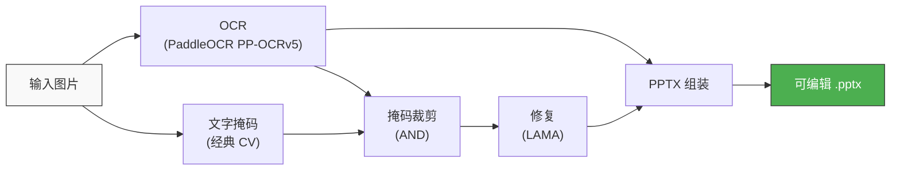

1. **OCR** 检测文字区域，获取边界框和文字内容
2. **文字掩码** 通过自适应阈值检测文字墨迹像素（无需 ML 模型）
3. **掩码裁剪** 将文字掩码与 OCR 边界框取交集 — 只遮盖确认的文字区域（保留插图、边框、图标）
4. **修复** 使用 LAMA 神经网络修复被遮盖的区域
5. **组装** 在干净背景上放置可编辑文本框，自动缩放字体并检测文字颜色

## 示例

每组展示**原始图片**（左）和**重建的 PPTX 预览**（右）。所有文字均为可编辑的文本框。

### 示例展示

**纯色背景上的文字幻灯片** — 文字位于纯色背景上，与照片分离。LAMA 能干净地修复平坦区域，照片完好保留。

| 输入 | 重建的 PPTX |
|------|------------|
| 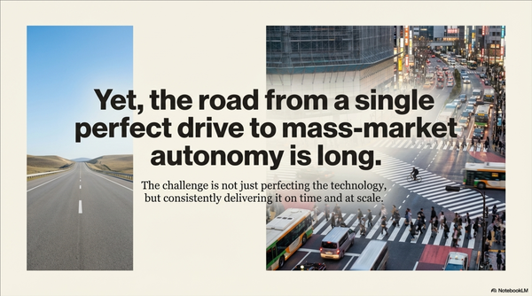 | 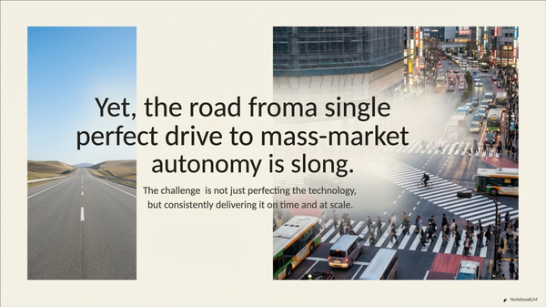 |

**带标签的图表** — 饼图的视觉元素（扇形、颜色）被完好保留，因为文字掩码只对高对比度的文字墨迹生效，不会影响平滑渐变。

| 输入 | 重建的 PPTX |
|------|------------|
| 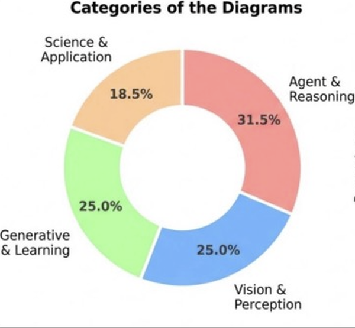 | 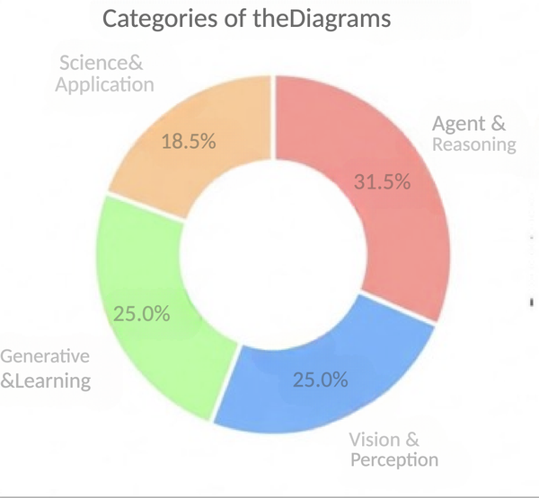 |

**照片背景上的密集文字** — 即使背景是复杂的照片（克莱斯勒大厦），LAMA 也能重建合理的纹理。多种字号和两栏布局通过列感知的行分组处理。

| 输入 | 重建的 PPTX |
|------|------------|
| 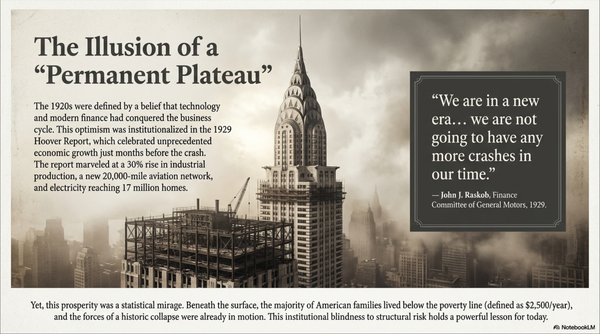 | 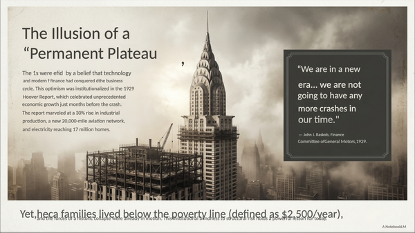 |

**中英文混合文字 + 纹理背景** — `ch` OCR 模型一次识别中英文。LAMA 自然修复水彩风格纹理，中文字体使用全角字宽度量精确放置。

| 输入 | 重建的 PPTX |
|------|------------|
| 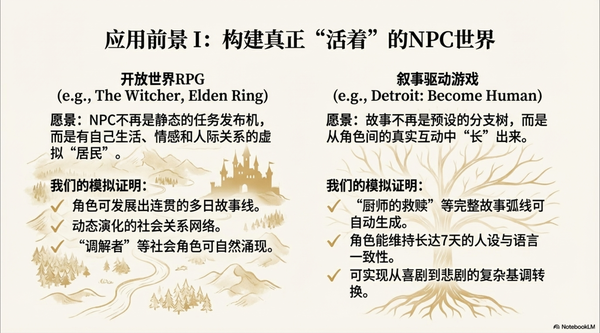 | 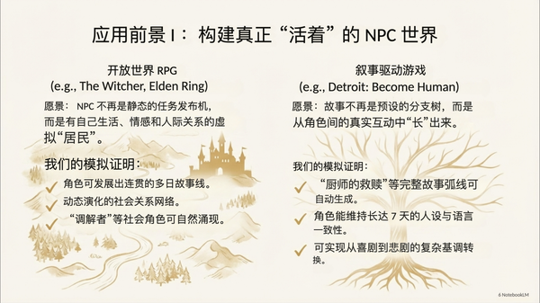 |

### 有挑战的案例

**超大/超粗字体** — 粗体文字（"362 MILES"）使用了异常粗大的字体，超出了标准掩码膨胀范围。默认参数针对常规幻灯片字号调优，超大或装饰性字体可能无法被膨胀掩码完全覆盖，导致修复后背景残留墨迹。

| 输入 | 重建的 PPTX |
|------|------------|
| 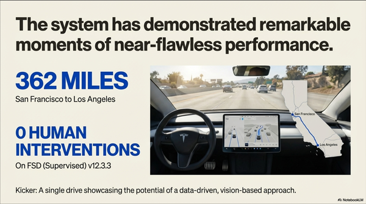 | 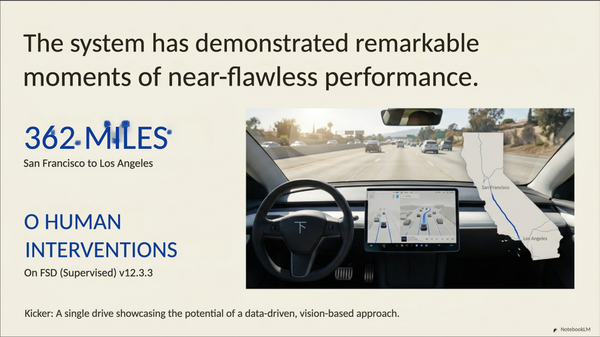 |

**密集标签的图表** — 柱状图中有大量密集的 OCR 区域（刻度、图例、百分比）。行分组逻辑会过度合并相邻标签，当多个检测结果在狭小空间竞争时，定位精度下降。

| 输入 | 重建的 PPTX |
|------|------------|
| 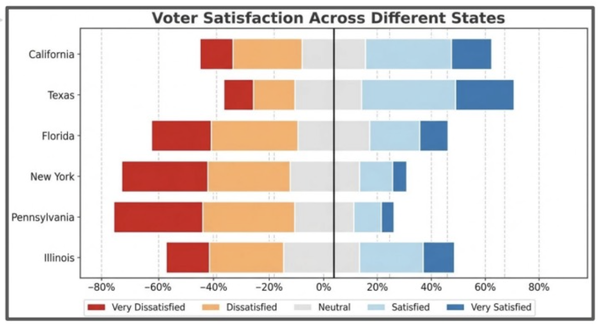 | 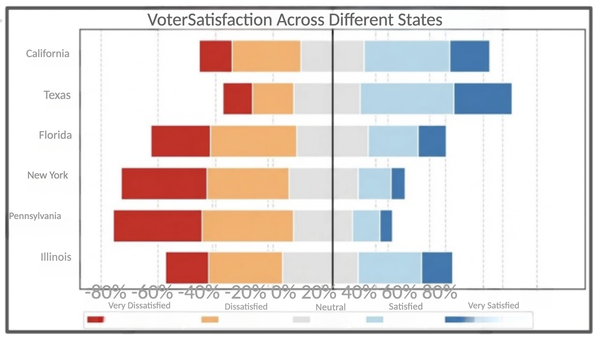 |

## 局限性

- **复杂背景上的文字**：当文字覆盖照片、插图或渐变时，LAMA 需要猜测文字下方的内容。平坦区域和重复纹理效果好，面部、精细细节效果差。
- **作为数据的文字**：坐标轴标签、图例等与图表紧密耦合的文字无法干净分离。
- **字体匹配**：统一使用 Arial/Helvetica 字体。装饰性、衬线或手写字体不会被还原 — 文字内容正确但字体不同。
- **文字排版**：每个 OCR 检测结果生成一个左对齐文本框。原始的居中、两端对齐等格式不会被重建。
- **亮色文字在深色背景上**：经典文字掩码检测深色墨迹。反色方案（白字黑底）下掩码退化为矩形边界框。
- **WebP 输入**：PaddleOCR (v3.x) 不支持 WebP。请先转换为 PNG/JPG。
- **超大图片**：LAMA 修复时间随分辨率增长。长边超过 ~4000px 的图片可能需要数分钟。

## 安装

```bash
git clone https://github.com/JadeLiu-tech/px-image2pptx.git
cd px-image2pptx
pip install -e ".[all]"
```

按需安装：

```bash
# 仅核心（文字掩码 + 组装，无 OCR/修复）
pip install -e .

# 含 OCR
pip install -e ".[ocr]"

# 含修复
pip install -e ".[inpaint]"
```

## 快速开始

### Python API

```python
from px_image2pptx import image_to_pptx

report = image_to_pptx("slide.png", "output.pptx")
print(f"创建了 {report['text_boxes']} 个文本框，耗时 {report['timings']}s")
```

### 命令行

```bash
# 完整流程
px-image2pptx slide.png -o output.pptx

# 中文幻灯片
px-image2pptx slide.png -o output.pptx --lang ch

# 跳过修复（纯色背景或使用原图作为背景）
px-image2pptx slide.png -o output.pptx --skip-inpaint

# 使用预计算的 OCR JSON（跳过 PaddleOCR）
px-image2pptx slide.png -o output.pptx --ocr-json text_regions.json

# 保留中间文件用于调试
px-image2pptx slide.png -o output.pptx --work-dir ./debug/
```

## 命令行选项

| 选项 | 默认值 | 说明 |
|------|--------|------|
| `-o`, `--output` | `output.pptx` | 输出 PPTX 路径 |
| `--ocr-json` | | 预计算的 OCR JSON（跳过 OCR 步骤） |
| `--lang` | `auto` | OCR 语言：`auto`、`en` 或 `ch` |
| `--sensitivity` | `16` | 文字掩码灵敏度（越低越激进） |
| `--dilation` | `12` | 文字掩码膨胀像素 |
| `--min-font` | `8` | 最小字号（磅） |
| `--max-font` | `72` | 最大字号（磅） |
| `--skip-inpaint` | | 跳过 LAMA 修复 |
| `--work-dir` | | 中间文件目录 |

## 模型

首次使用时自动下载（共约 370 MB）。

| 模型 | 大小 | 许可证 | 下载位置 |
|------|------|--------|----------|
| [PP-OCRv5_server_det](https://github.com/PaddlePaddle/PaddleOCR)（文字检测） | 84 MB | Apache 2.0 | `~/.paddlex/official_models/` |
| [PP-OCRv5_server_rec](https://github.com/PaddlePaddle/PaddleOCR)（文字识别） | 81 MB | Apache 2.0 | `~/.paddlex/official_models/` |
| [big-lama](https://github.com/advimman/lama)（修复） | 196 MB | Apache 2.0 | `~/.cache/torch/hub/checkpoints/` |

## 性能

在 MacBook Pro (M1 Pro) 上测试：

| 步骤 | 耗时 | 模型 |
|------|------|------|
| OCR (PaddleOCR PP-OCRv5) | 2-5s | 165 MB |
| 文字掩码 + 裁剪 | 1-3s | 无（经典 CV） |
| 修复 (LAMA) | 4-8s | 196 MB |
| PPTX 组装 | <0.2s | 无 |
| **合计** | **8-16s** | **~370 MB** |

## 测试

```bash
pytest tests/test_e2e.py -v
```

## 许可证

MIT 许可证。详见 [LICENSE](LICENSE)。
